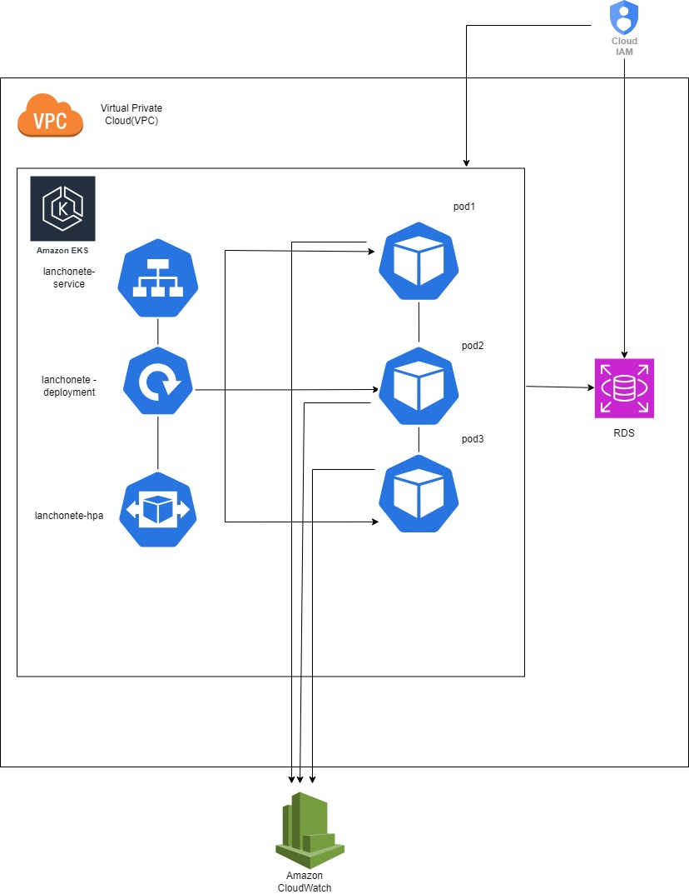
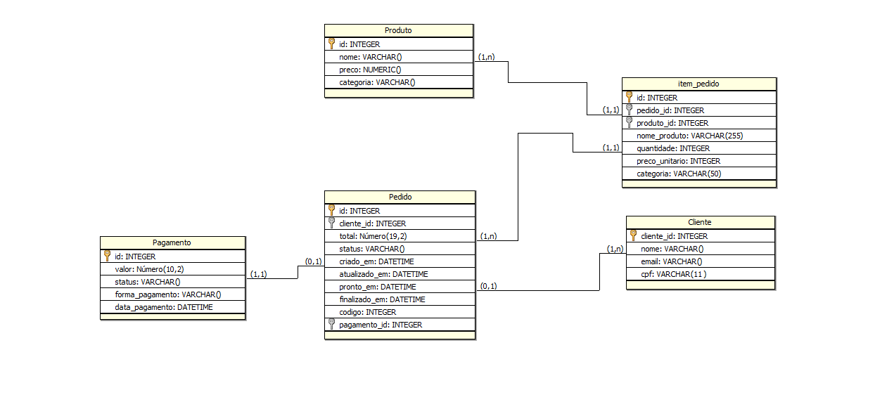

# Projeto da lanchonete Grupo 18 Pós-Tech - FIAP


O objetivo do projeto é disponibilizar APIs para os seguintes serviços da lanchonete:

- cadastro de cliente
- identificação do cliente via CPF
- criar, editar e remover produtos
- buscar produtos por categoria
- Fake checkout, apenas enviar os produtos escolhidos para a fila. O checkout é a finalização do pedido.
- listar pedidos

O propjeto foi desenvolvido utilizando as seguintes tecnologias:

- java 17+
- springboot 3.1+
- docker
- banco de dados postgres 16

## Executando o projeto localmente

Baixe o projeto no seguinte endereço:

- https://github.com/tiagogn/tech_challenge_grupo_18

em seguinte, dentro da pasta do projeto execute o comando

```shell
idea .
```

com isso, o projeto será aberto dentro da IDE **Intellij**

Para rodar o projeto através do Docker Compose, utilize o seguinte comando:

```shell
docker-compose -f docker-compose.yaml up -d
```

ou execute o seguinte comando na pasta do projeto:

```shell
./gradlew bootRun
```

## Swagger

* API (http://localhost:8080/lanchonete/swagger-ui/index.html)

## Postman

Dentro do projeto, existe uma collection do Postman com os endpoints para teste.

* Collection (lanchonete/Tech
  Challenge.postman_collection.json) [Download](Tech%20Challenge.postman_collection.json)
* Environment (lanchonete/Tech
  Challenge.postman_environment.json) [Download](Tech%20Challenge.postman_environment.json)

Em cada endpoint, existe um exemplo de requisição para teste.

Ordem de execução dos endpoints:

1. POST Produto/Cadastrar Produto
2. POST Cliente/Cadastrar Cliente(opcional)
3. POST Pedido/Cadastrar Pedido
4. POST Pagamento/Webhook
5. PATCH Pedido/Pedido em Preparação
6. PATCH Pedido/Pedido Pronto
7. PATCH Pedido/Pedido Finalizado
8. GET Pedido/Listar Pedido

## Kubernetes

A arquitetura local proposta em Kubernetes visa atender aos requisitos de escalabilidade, permitindo o aumento e
diminuição de Pods de acordo com a demanda. Para isso, implementamos dois Deployments: um para a aplicação e outro para
o banco de dados.

A arquitetura local proposta em Kubernetes visa atender aos requisitos de escalabilidade, permitindo o aumento e
diminuição de Pods de acordo com a demanda. Para isso, implementamos dois Deployments: um para a aplicação e outro para
o banco de dados.

#### Deployments:

Deployment da Aplicação: Inicializa com 3 Pods.

Projetado para escalar automaticamente conforme a carga.

Deployment do Banco de Dados: Inicia com 1 Pod. Gerencia a persistência e integridade dos dados.

Configuração do Horizontal Pod Autoscaler (HPA) Para otimizar a escalabilidade da aplicação, configuramos o Horizontal
Pod Autoscaler (HPA) com as seguintes especificações:

#### Métricas de Escalonamento:

Mínimo de Pods: 2 Pods devem estar sempre disponíveis para garantir a continuidade do serviço. Máximo de Pods: O limite
é de 10 Pods para evitar sobrecarga e garantir uso eficiente dos recursos.

#### Critério de Escalonamento:

Quando um Pod atingir 80% de consumo da CPU, o HPA acionará a criação de um novo Pod. Isso assegura que a aplicação
mantenha um desempenho ideal mesmo em picos de demanda.

Fluxo de Trabalho Monitoramento: O HPA monitora continuamente o uso de CPU dos Pods da aplicação.

Ajuste Dinâmico: À medida que a demanda aumenta e um ou mais Pods atingem o limite de 80% de uso da CPU, novos Pods são
criados automaticamente até o limite máximo de 10.

Escalonamento para Baixa Demanda: Quando a demanda diminui, o HPA pode reduzir o número de Pods, mantendo sempre pelo
menos 2 Pods em operação

Arquitetura To Be Kubernetes na CLOUD



### Para rodar o projeto no Kubernetes, utilize os seguintes comandos, dentro da pasta raíz do projeto:

```shell
kubectl create namespace lanchonete

kubectl apply -R -f manifests/

kubectl apply -f https://github.com/kubernetes-sigs/metrics-server/releases/latest/download/components.yaml

kubectl get pods -n lanchonete //lista os pods

kubectl top pods -n lanchonete  //exibe métrica de consumo dos pods
 
```

## Link do Miro

https://miro.com/app/board/uXjVK5FMZfo=/

## Link Video Fase 2

https://youtube.com/watch?v=83lInn7reAA&feature=shared

## Fase 3

## Modelagem Banco de dados


